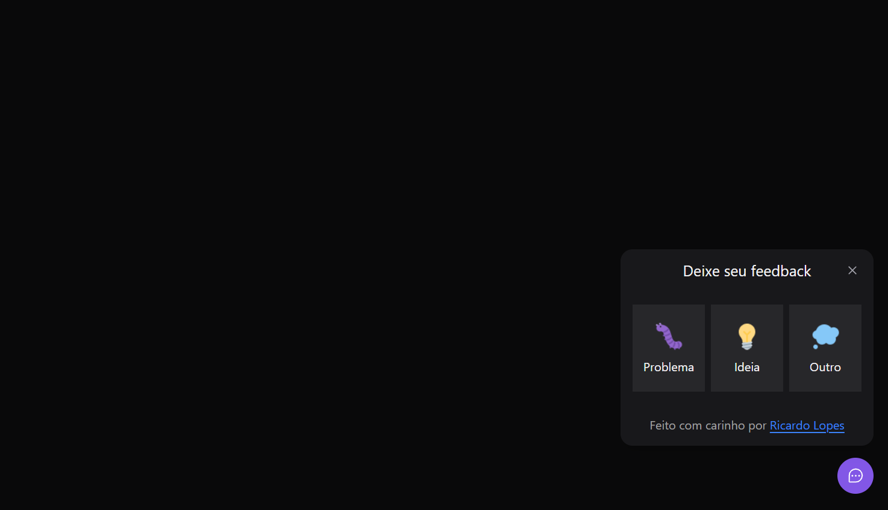
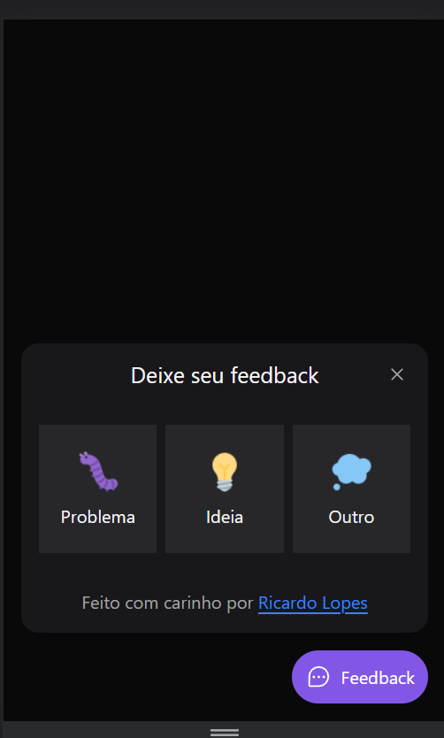

# NLW Return | NLW #8

App em produção: [RLopes-NLW-Return](https://rlopes-nlw-return.vercel.app/)

## Descrição da Aplicação

Esta aplicação consiste em um *Widget* para os usuários reportarem um BUG, IDEIA ou OUTRO (algum *feedback* qualquer). A aplicação foi implementada com a bibliotaca `React`, uma biblioteca para desenvolvimento *front-end* com `JavaScript`, e `Node` no *back-end*.

Na aplicação também é possível fazer um *screenshot* da tela para ser enviaedo junto ao *feedback*, que, ao ser enviado, a aplicação notifica o desenvolvedor com um e-mail recebido na plataforma [Mailtrap](https://mailtrap.io/).

## Telas

## Tecnologias utilizadas

### Front-end

 
 
 
 

### Back-end

 
 

 
 
 

## Banco de dados

### Em desenvolvimento

### Em produção
 

## Em produção na nuvem

### Front-end
Foi hospedado na plataforma [Vercel](https://vercel.com/).

### Back-end
Foi hospedado na plataforma [Railway](https://railway.app/).

## Agradecimentos
 
